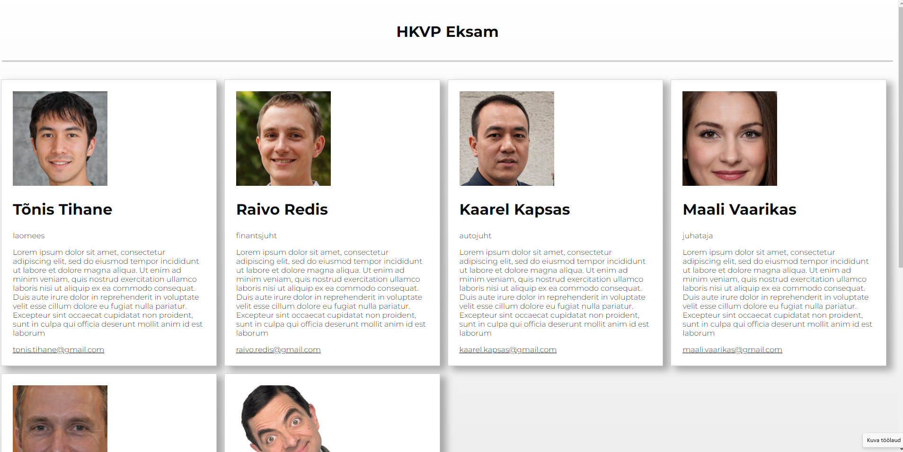

<!-- Wordpressi teema "HKVP"-->
## Wordpressi teema "HKVP"
<p id="top"></p>



TLÜ Haapsalu Kolledži veebiprogrammeerimse õppeiane raames loodud Wordpressi teema

<p align="right">(<a href="#top">tagasi üles</a>)</p>


### Loodud kasutades:

* [PHP](https://php.net/)
* [Unspalsh](https://unsplash.org/)
* [Pe-icon-7-stroke](https://themes-pixeden.com/font-demos/7-stroke/)


<p align="right">(<a href="#top">tagasi üles</a>)</p>

### Ülesehitus

1. `header.php` - lehe päise osa (head) ja peamenüü  
2. `footer.php` - lehe jaluse osa ja social menüü näitamine
3. `home.php` - esilehe kuvamiseks, näitab kõiki postitusi
4. `single.php` - üksiku postituse kuvamiseks
5. `index.php` - muude lehtede (näit. kasutustingimused jms) kuvamiseks
6. `functions.php` - teema seadistused, css laadimine

### Seadistamine

1. Klooni repo wordpressi teemade kausta wp-content/themes/
   ```sh
   git clone https://github.com/kaiusk/HKVR
   ```
2. Wordpressis vali uueks teemaks HKVP 
3. Lisa uued menüüd. Lubatud on kaks menüüd - ülemine pea-menüü ja alumine jaluse menüü
4. Lisa postitused. Lisa ka väljavõte ja pilt.
5. Luba lisaväljad: 
   1. postituse lisamise vaates klikid paremal üleval nurgas punktidega nupul (valikud)
   2. valid viimase menüü 'Preferences'
   3. vasakult valid 'Panels'
   4. paremal all on näha 'Additional' ja selle all 'Lisaväljad'
   5. lülita nupp sisse ja salvesta 
6. Postitustel luba lisaväljad. Lisa lisaväli 'hind' ja sellele vastav väärtus
7. Selleks et üht postitust esile tõsta (enimmüüdud) märgi see kui "Kinnista see postitus esilehele"

<p align="right">(<a href="#top">tagasi üles</a>)</p>


<!-- CONTACT -->
## Kontakt

Kaius Karon - [kaiusk@tlu.ee](kaiusk@tlu.ee) 

Project Link: [https://github.com/kaiusk/HKVR](https://github.com/kaiusk/HKVR)

<p align="right">(<a href="#top">tagasi üles</a>)</p>
